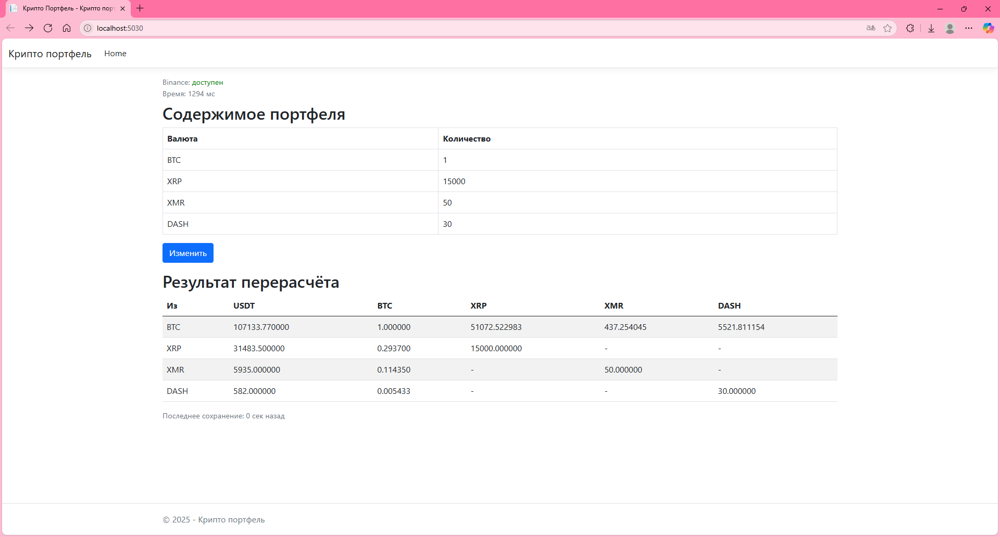
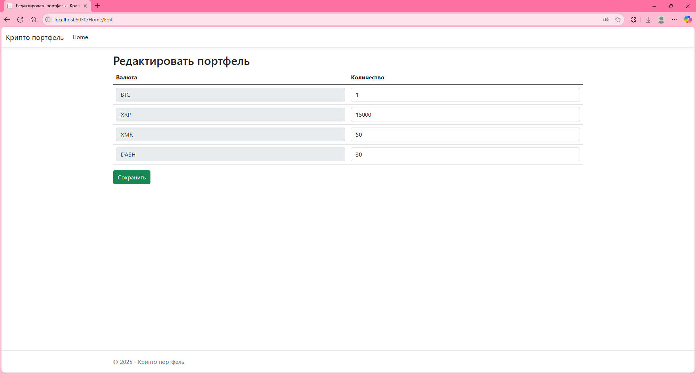

# Крипто портфель 

Проект ориентирован на демонстрацию возможностей работы с ASP.NET и внешними API уже готовых сервисов. В данном случае используется [API биржи Binance](https://www.binance.com/en/binance-api).

### Введение

Сам проект содержит два подпроекта __CryptoLinker.Core__ и __CryptoLinker.Web__.
* CryptoLinker.Web - страница взаимодействия пользователя с биржей и просмотр актуальных курсов.
* CryptoLinker.Core - промежуточная библиотека, работающая напрямую с API биржи и упрощающая взаимодействие с ней через готовые методы.

При желании, конечные эндпоинты API сервисов могут быть заменены на другие. Все url-адреса захардкожены в классах __RialtoMarketClient__ и  __RialtoStatusService__. Оба класса относятся к библиотеке __CryptoLinker.Core__ и могут быть полностью изменены и/или подогнаны под работу с другими API.

### Основной функционал

Конечный пользователь может отслеживать актуальные курсы используемой в проекте биржи (по умолчанию Binance).

Конечный пользователь может смотреть цену своего портфеля по актуальному курсу, который постоянно обновляется.

Конечный пользователь может изменять ценность своего портфеля.

